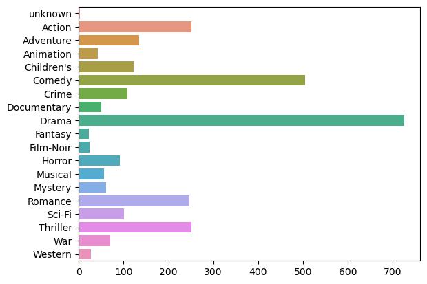
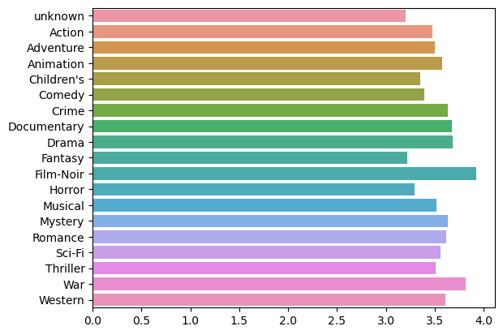
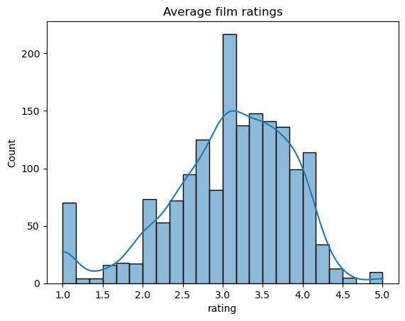
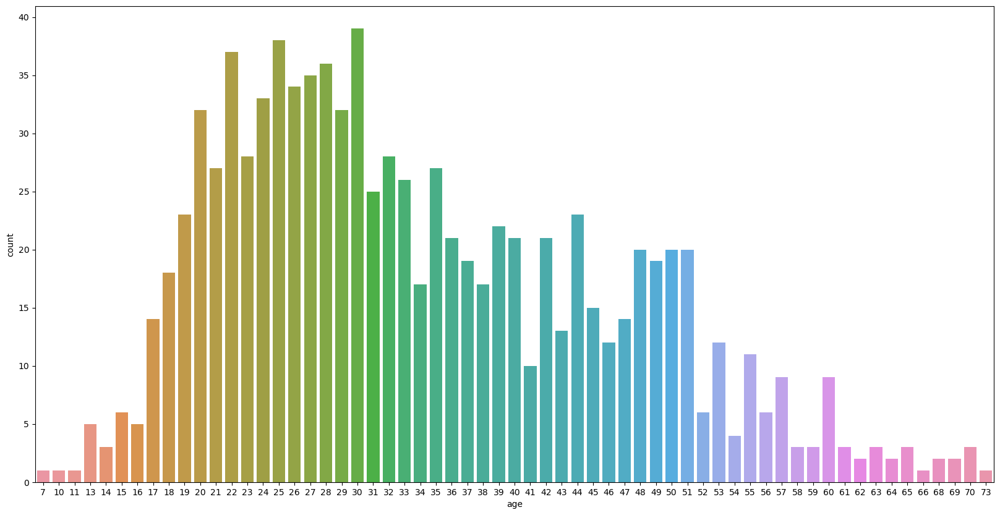
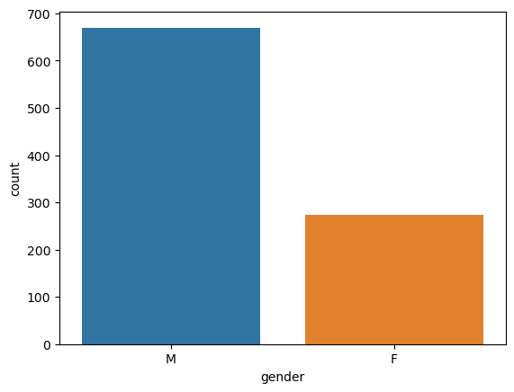
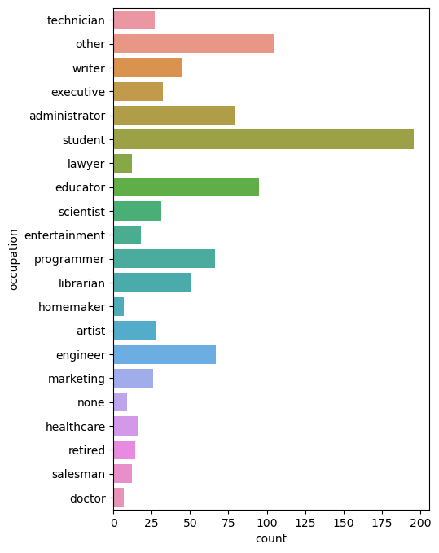
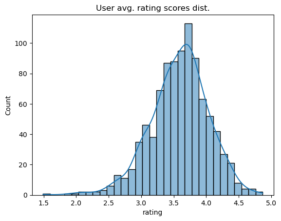
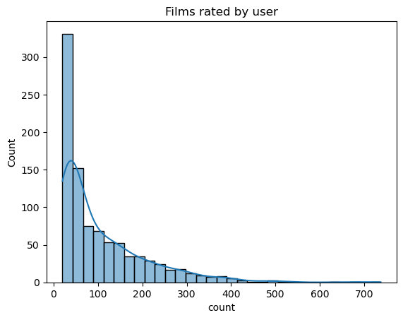
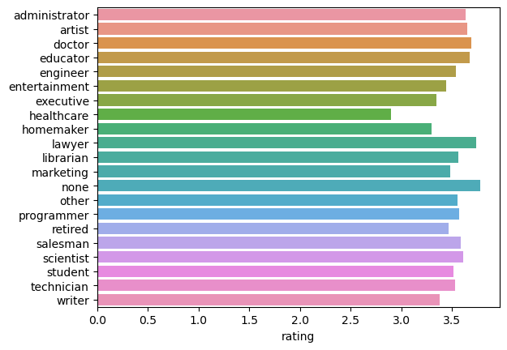

# Movie Recommendation report

## Introduction
...
## Data analysis
### Films overview
Number of genres in dataset

Average scores of films by genres

Distribution of film average ratings

We can see that the most films have about 3-4 rating and only small number of films are rated on average as very good (above 4.5)

Distribution of individual rating scores

### Users overview

The age distribution

We can see the majority of users are in middle ages (between 17 and 35)

Gender distribution

Employment of the users.

Students is quite a big group of film watchers

Distribution of how on average user rate films

We can see users on average give scores of 3-4.

How many films are rated by one user

Even though majority of users rate less than ~40 films, there are peple who rated more than hundereds of films

The average rating given to the films by peoplke of different occupation

Somewhy healthcare workers give smaller ratings on films than the others. It may be the cause of occupation, or rather the films that such people watch are worse on average.

## Model Implementation
...
## Model Advantages and Disadvantages
...
## Training Process
...
## Evaluation
...
## Results