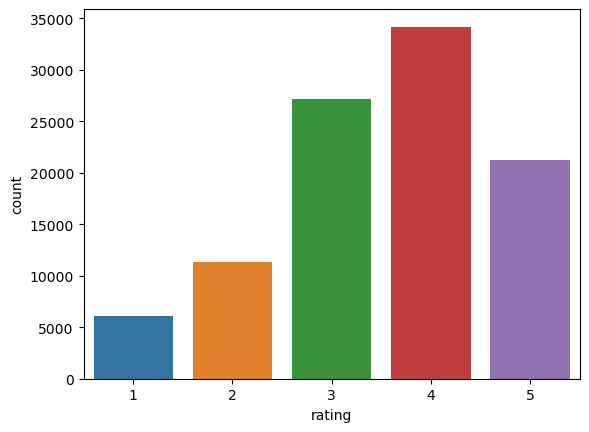

# Movie Recommendation report

## Introduction
For the movie recommendation system I used LightFM model.
## Data analysis
### Films overview
Number of genres in dataset


Average scores of films by genres


Distribution of film average ratings

We can see that the most films have about 3-4 rating and only small number of films are rated on average as very good (above 4.5)


Distribution of individual rating scores



### Users overview

The age distribution

We can see the majority of users are in middle ages (between 17 and 35)


Gender distribution


Employment of the users.

Students is quite a big group of film watchers


Distribution of how on average user rate films

We can see users on average give scores of 3-4.


How many films are rated by one user

Even though majority of users rate less than ~40 films, there are peple who rated more than hundereds of films


The average rating given to the films by peoplke of different occupation

Somewhy healthcare workers give smaller ratings on films than the others. It may be the cause of occupation, or rather the films that such people watch are worse on average.


## Model Implementation
The model used is [LightFM](https://making.lyst.com/lightfm/docs/home.html). It is a hybrid matrix factorisation model representing users and items as linear combinations of their content features' latent factors. It uses both the internal (movie ratings history) and external (users and movies metadata such as age, gender, genres) data.

## Model Advantages and Disadvantages
The model is a combination of collaborative filtering and content-based approaches. So, it uses both the user-item interactions as well as the other information about users and items. So, it makes predictions more accurate and mitigates the cold-start problem when no interaction data is collected for a new user or item. Morevoer, the model is designed to scale efficiently and work with sparse interaction matricies.

## Training Process
The model was trained with Weighted Approximate-Rank Pairwise (WARP) loss. It maximises the rank of positive examples by repeatedly sampling negative examples until rank violating one is found.

The parameters of the training are:

```# default number of recommendations
TEST_PERCENTAGE = 0.2

LEARNING_RATE = 0.25

# no of latent factors
NO_COMPONENTS = 30

NO_EPOCHS = 30

# regularisation for both user and item features
ITEM_ALPHA = 1e-6
USER_ALPHA = 1e-6
```
## Evaluation
For evaluation 4 metrics common in recommendation systems were chosen.

**ROC AUC** - the probability that a randomly chosen positive example has a higher score than a randomly chosen negative example.

**Precision@k** - the fraction of known positives in the first k positions of the ranked list of results.

**Recall@k**- the number of positive items in the first k positions of the ranked list of results divided by the number of positive items in the test period. 

**Reciprocal rank** - 1 / the rank of the highest ranked positive example

The evaluation results are the following:

```
Train auc: 0.94
Test auc: 0.93

Train precision@10: 0.61
Test precision@10: 0.33

Train recall@10: 0.12
Test recall@10: 0.20

Train reciporial rank: 0.83
Test reciporial rank: 0.64
```

## Results
The model used shows really good performance metrics and suits the task well as it can be easily scaled, maintaned and trained further on new data (i.e. new users or movies)


## References
Metrics description - https://making.lyst.com/lightfm/docs/lightfm.evaluation.html

Model - https://making.lyst.com/lightfm/docs/index.html

Others:

https://github.com/recommenders-team/recommenders/blob/main/examples/02_model_hybrid/lightfm_deep_dive.ipynb

